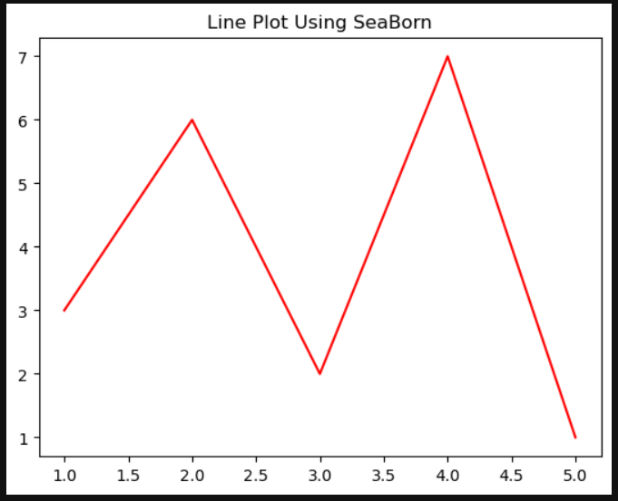
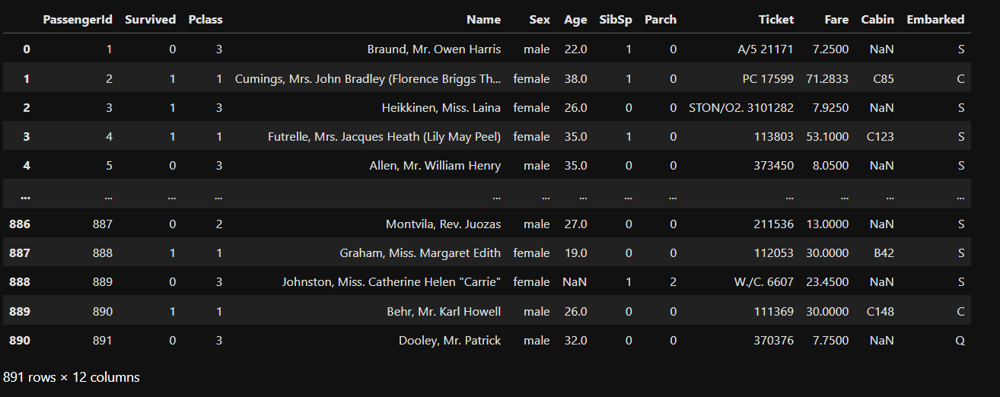

# EXNO-6-DS-DATA VISUALIZATION USING SEABORN LIBRARY

# Aim:
  To Perform Data Visualization using seaborn python library for the given datas.

# EXPLANATION:
Data visualization is the graphical representation of information and data. By using visual elements like charts, graphs, and maps, data visualization tools provide an accessible way to see and understand trends, outliers, and patterns in data.

# Algorithm:
STEP 1:Include the necessary Library.

STEP 2:Read the given Data.

STEP 3:Apply data visualization techniques to identify the patterns of the data.

STEP 4:Apply the various data visualization tools wherever necessary.

STEP 5:Include Necessary parameters in each functions.

# Coding and Output:
 
## Data Visualization using SeaBorn

### Line Plot

```python
import pandas as pd
import numpy as np
import seaborn as sns
import matplotlib.pyplot as plt
```

```python
# Datas
x = [1, 2, 3, 4, 5]
y = [3, 6, 2, 7, 1]
```

```python
# Create line plot using seaborn
plt.plot(x,y,color="red")
plt.title("Line Plot Using SeaBorn")
plt.show()
```
  

```python
x = [1, 2, 3, 4, 5]
y1 = [3, 5, 2, 6, 1]
y2 = [1, 6, 4, 3, 8]
y3 = [5, 2, 7, 1, 4]
```

```python
# implement line plot and include all the necessary parameters
plt.plot(x, y1, label="Line-1", c="red", ls="-", lw="1", marker="s", mfc="cyan")
plt.plot(x, y2, label="Line-2", c="green", ls="--", lw="2", marker="o", mfc="magenta")
plt.plot(x, y3, label="Line-3", c="blue", ls=":", lw="2", marker="d", mfc="orange")
plt.title("Multi-Line Plot")
plt.legend() 
plt.show()
```
  

### Bar Plot

```python
tips = sns.load_dataset('tips')
tips
```
  

```python
# Implement Bar plot with hue parameter
sns.barplot(x="day", y="total_bill", hue="sex", data=tips)
# Set labels and title
plt.xlabel("Days")
plt.ylabel("Average Total Bill")
plt.title("Average Bill Per Day by Gender")
plt.show()
```
  

```python
# Include titanic dataset
tit=pd.read_csv("titanic_dataset.csv")
tit
```
  

```python
plt.figure(figsize=(8,5))
# Implement barplot using seaborn and set x='Embarked',y='Fare',data=tit, palette='rainbow' and set graph title as "Fare of Passenger by Embarked Town"
sns.barplot(x="Embarked", y="Fare", data=tit, palette="rainbow", hue="Embarked")
plt.xlabel("Embarked Town")
plt.ylabel("Fare")
plt.title("Fare of Passenger by Embarked Town")
plt.show()
```
  

```python
plt.figure(figsize=(8,5))
# Implement barplot using seaborn and set x='Embarked',y='Fare',data=tit, palette='rainbow',hue='Pclass' and set graph title as "Fare of Passenger by Embarked Town, Divided by Class"
sns.barplot(x="Embarked", y="Fare", data=tit, palette="rainbow", hue='Pclass')
plt.xlabel("Embarked Town")
plt.ylabel("Fare Paid")
plt.title("Fare of Passenger by Embarked Town, Divided by Class")
plt.show()
```
  

```python
import seaborn as sns
# using tips dataset implement Scatter plot of total bill vs tip amount
sns.scatterplot(x="total_bill", y="tip", data=tips)
# Set labels and title
plt.xlabel('Total Bill')
plt.ylabel('Tip Amount')
plt.title('Scatter Plot of Total Bill vs. Tip Amount')
plt.show()
```
  

### Violin Plot

```python
# implement violinplot by comparing any two values from titanic data set
plt.figure(figsize=(10,6))
sns.violinplot(x="Pclass", y="Age", hue="Sex", palette="rainbow", data=tit)
plt.xlabel("Passenger Class")
plt.ylabel("Age")
plt.title("Distribution of Age by Passenger Class grouped by Gender")
plt.show()
```
  

### Histogram

```python
import seaborn as sns
import numpy as np
import pandas as pd
```

```python
np.random.seed(0)
marks = np.random.normal(loc=70, scale=10, size=100)
```

```python
# Generating dataset of random numbers
np.random.seed(1)
num_var = np.random.randn(1000)
num_var = pd.Series(num_var, name = "Numerical Variable")
num_var
```
  

```python
# IMPLEMENT HISTOGRAM
sns.histplot(marks, bins=40, color='skyblue', edgecolor='black')
plt.title('Histogram of Student Marks with KDE')
plt.xlabel('Marks')
plt.ylabel('Frequency')
plt.show()
```
  

```python
sns.histplot(num_var, bins=50, color="red", edgecolor="black", alpha=0.5, kde=True)
plt.xlabel("Values")
plt.ylabel("Count")
plt.title("Variable Count")
plt.show()
```
  

```python
# IMPLEMENT histplot in seaborn and set parameters data=df,x=Pclass,hue=Survived,kde=True
sns.histplot(data=tit, x="Pclass", hue="Survived", kde=True)
plt.xlabel('Passenger Class')
plt.ylabel("Survived")
plt.show()
```
  

# Result:

Thus, Data visualization using seaborn library has been successfully implemented.
